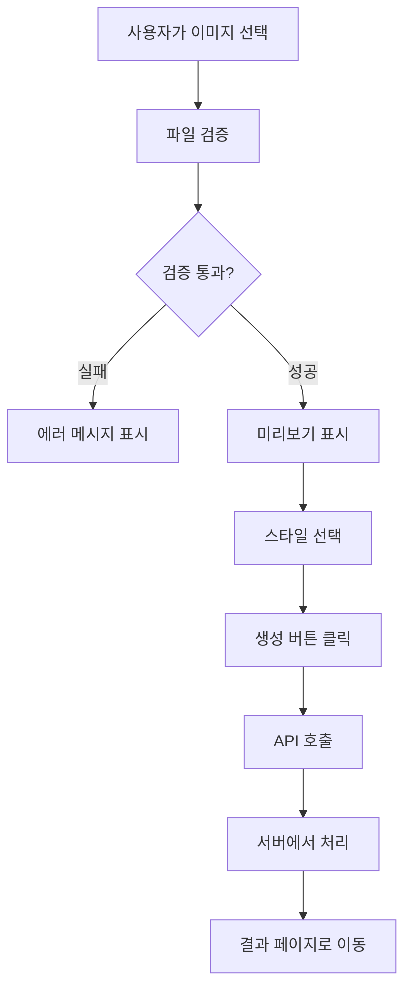

# WeddingAI 개발 가이드

## 🎯 Phase 1 개발 완료 사항

### ✅ 완료된 기능들

1. **Next.js 프로젝트 초기 설정**

   - App Router 기반 구조
   - TypeScript 설정
   - TailwindCSS 설정
   - ESLint 설정

2. **폴더 구조 생성**

   - 케밥케이스 라우팅 구조
   - 서버/클라이언트 컴포넌트 분리
   - 공용 컴포넌트 구조

3. **기본 UI 컴포넌트**

   - Button, Input, Card, LoadingSpinner
   - 웨딩 테마 디자인 시스템
   - 반응형 디자인

4. **인증 시스템**

   - NextAuth.js 설정
   - Google, Kakao 소셜 로그인
   - 세션 관리

5. **데이터베이스 스키마**

   - Prisma 스키마 설계
   - 사용자, 주문, 생성 이미지 모델
   - 관계형 데이터 구조

6. **기본 페이지 구조**
   - 랜딩 페이지 (서비스 소개)
   - 업로드 페이지 (이미지 업로드, 스타일 선택)
   - 결과 페이지 (생성 결과 확인)

## 🏗 코드 구조 상세 설명

### 1. 컴포넌트 아키텍처

#### 서버 컴포넌트 (기본)

```typescript
// src/app/page.tsx - 홈 페이지 (서버 컴포넌트)
export default function Home() {
  // 서버에서 렌더링, SEO 최적화
  return <div>{/* 정적 콘텐츠 */}</div>;
}
```

#### 클라이언트 컴포넌트

```typescript
// src/app/_components/ImageUpload.tsx
"use client"; // 클라이언트에서만 실행

export function ImageUpload() {
  const [file, setFile] = useState<File | null>(null);
  // 상호작용이 필요한 로직
}
```

### 2. 상태 관리 패턴

#### Zustand Store 구조

```typescript
// src/store/useAuthStore.ts
interface AuthState {
  user: User | null;
  isLoading: boolean;
  setUser: (user: User | null) => void;
  setLoading: (loading: boolean) => void;
  updateCredits: (credits: number) => void;
}

export const useAuthStore = create<AuthState>()(
  persist(
    (set) => ({
      user: null,
      isLoading: true,
      setUser: (user) => set({ user }),
      setLoading: (isLoading) => set({ isLoading }),
      updateCredits: (credits) =>
        set((state) => ({
          user: state.user ? { ...state.user, credits } : null,
        })),
    }),
    {
      name: "auth-storage", // localStorage 키
      partialize: (state) => ({ user: state.user }), // 저장할 데이터만 선택
    }
  )
);
```

### 3. API 라우트 패턴

#### RESTful API 설계

```typescript
// src/app/api/generate/route.ts
export async function POST(request: NextRequest) {
  try {
    // 1. 인증 확인
    const session = await auth();
    if (!session?.user?.id) {
      return NextResponse.json(
        { success: false, error: "로그인이 필요합니다." },
        { status: 401 }
      );
    }

    // 2. 권한 확인 (크레딧)
    const user = await prisma.user.findUnique({
      where: { id: session.user.id },
      select: { credits: true },
    });

    if (!user || user.credits < 1) {
      return NextResponse.json(
        { success: false, error: "크레딧이 부족합니다." },
        { status: 400 }
      );
    }

    // 3. 데이터 검증
    const formData = await request.formData();
    const imageFile = formData.get("image") as File;

    // 4. 비즈니스 로직 실행
    const result = await processImage(imageFile);

    // 5. 응답 반환
    return NextResponse.json({
      success: true,
      imageId: result.id,
    });
  } catch (error) {
    // 에러 처리
    console.error("API Error:", error);
    return NextResponse.json(
      { success: false, error: "서버 오류가 발생했습니다." },
      { status: 500 }
    );
  }
}
```

### 4. 데이터베이스 패턴

#### Prisma 스키마 설계

```prisma
// prisma/schema.prisma
model User {
  id            String    @id @default(cuid())
  email         String    @unique
  credits       Int       @default(3)
  createdAt     DateTime  @default(now())
  updatedAt     DateTime  @updatedAt

  // 관계 정의
  accounts Account[]
  sessions Session[]
  orders   Order[]
  images   GeneratedImage[]
}

model GeneratedImage {
  id           String      @id @default(cuid())
  userId       String
  originalUrl  String
  generatedUrl String?
  prompt       String
  style        String
  status       ImageStatus @default(PROCESSING)
  createdAt    DateTime    @default(now())
  updatedAt    DateTime    @updatedAt

  // 외래키 관계
  user User @relation(fields: [userId], references: [id], onDelete: Cascade)
}

enum ImageStatus {
  PROCESSING
  COMPLETED
  FAILED
}
```

#### 데이터베이스 접근 패턴

```typescript
// src/lib/prisma.ts
import { PrismaClient } from "@prisma/client";

const globalForPrisma = globalThis as unknown as {
  prisma: PrismaClient | undefined;
};

// 싱글톤 패턴으로 Prisma 클라이언트 관리
export const prisma = globalForPrisma.prisma ?? new PrismaClient();

if (process.env.NODE_ENV !== "production") globalForPrisma.prisma = prisma;
```

### 5. 타입 시스템

#### 중앙화된 타입 정의

```typescript
// src/types/index.ts
export interface User {
  id: string;
  name?: string | null;
  email: string;
  image?: string | null;
  credits: number;
  createdAt: Date;
  updatedAt: Date;
}

export interface GeneratedImage {
  id: string;
  userId: string;
  originalUrl: string;
  generatedUrl?: string | null;
  prompt: string;
  style: string;
  status: "PROCESSING" | "COMPLETED" | "FAILED";
  createdAt: Date;
  updatedAt: Date;
}

// API 요청/응답 타입
export interface GenerateImageRequest {
  imageUrl: string;
  style: string;
  prompt?: string;
}

export interface GenerateImageResponse {
  success: boolean;
  imageId?: string;
  generatedUrl?: string;
  error?: string;
}
```

### 6. 유틸리티 함수 패턴

#### 재사용 가능한 유틸리티

```typescript
// src/lib/utils.ts
import { type ClassValue, clsx } from "clsx";
import { twMerge } from "tailwind-merge";

// TailwindCSS 클래스 병합 유틸리티
export function cn(...inputs: ClassValue[]) {
  return twMerge(clsx(inputs));
}

// 파일 검증 유틸리티
export function validateImageFile(file: File): {
  valid: boolean;
  error?: string;
} {
  const maxSize = 10 * 1024 * 1024; // 10MB
  const allowedTypes = ["image/jpeg", "image/png", "image/webp"];

  if (!allowedTypes.includes(file.type)) {
    return {
      valid: false,
      error: "JPEG, PNG, WebP 파일만 업로드 가능합니다.",
    };
  }

  if (file.size > maxSize) {
    return {
      valid: false,
      error: "파일 크기는 10MB 이하여야 합니다.",
    };
  }

  return { valid: true };
}
```

## 🎨 UI/UX 패턴

### 1. 디자인 시스템

#### 색상 체계

```css
/* src/app/globals.css */
:root {
  /* 웨딩 테마 색상 */
  --rose-50: #fdf2f8;
  --rose-100: #fce7f3;
  --rose-600: #e11d48;
  --rose-700: #be185d;
}
```

#### 컴포넌트 변형 패턴

```typescript
// src/app/_components/ui/Button.tsx
interface ButtonProps {
  variant?: "primary" | "secondary" | "outline" | "ghost";
  size?: "sm" | "md" | "lg";
  loading?: boolean;
}

const variants = {
  primary: "bg-rose-600 text-white hover:bg-rose-700",
  secondary: "bg-rose-100 text-rose-900 hover:bg-rose-200",
  outline:
    "border border-rose-300 bg-transparent text-rose-700 hover:bg-rose-50",
  ghost: "text-rose-700 hover:bg-rose-50",
};

const sizes = {
  sm: "h-9 px-3 text-sm",
  md: "h-11 px-6 text-base",
  lg: "h-13 px-8 text-lg",
};
```

### 2. 반응형 디자인 패턴

#### 모바일 퍼스트

```typescript
// 반응형 그리드 예시
<div className="grid grid-cols-1 gap-4 sm:grid-cols-2 lg:grid-cols-4">
  {/* 모바일: 1열, 태블릿: 2열, 데스크톱: 4열 */}
</div>
```

### 3. 애니메이션 패턴

#### CSS 애니메이션

```css
/* src/app/globals.css */
.fade-in {
  animation: fadeIn 0.5s ease-in-out;
}

@keyframes fadeIn {
  from {
    opacity: 0;
    transform: translateY(20px);
  }
  to {
    opacity: 1;
    transform: translateY(0);
  }
}
```

## 🔄 데이터 플로우 패턴

### 1. 이미지 업로드 플로우



### 2. 상태 관리 플로우

```typescript
// 클라이언트에서 서버 상태 동기화
const { data: session } = useSession(); // NextAuth 세션
const { user, setUser } = useAuthStore(); // Zustand 상태

useEffect(() => {
  if (session?.user) {
    setUser({
      id: session.user.id,
      email: session.user.email,
      credits: session.user.credits,
    });
  }
}, [session, setUser]);
```

## 🔒 보안 패턴

### 1. 인증 미들웨어

```typescript
// API 라우트에서 인증 확인 패턴
const session = await auth();
if (!session?.user?.id) {
  return NextResponse.json({ error: "로그인이 필요합니다." }, { status: 401 });
}
```

### 2. 파일 업로드 보안

```typescript
// 파일 타입 및 크기 검증
const allowedTypes = ["image/jpeg", "image/png", "image/webp"];
const maxSize = 10 * 1024 * 1024; // 10MB

if (!allowedTypes.includes(file.type)) {
  throw new Error("지원하지 않는 파일 형식");
}

if (file.size > maxSize) {
  throw new Error("파일 크기 초과");
}
```

## 📈 성능 최적화 패턴

### 1. 서버 컴포넌트 활용

```typescript
// 데이터 페칭을 서버에서 처리
export default async function ResultPage({
  params,
}: {
  params: { id: string };
}) {
  // 서버에서 데이터 페칭
  const generatedImage = await prisma.generatedImage.findFirst({
    where: { id: params.id },
  });

  // 클라이언트 컴포넌트에 props로 전달
  return <ResultClient generatedImage={generatedImage} />;
}
```

### 2. 이미지 최적화

```typescript
import Image from "next/image";

// Next.js 이미지 컴포넌트 사용
<Image
  src={imageUrl}
  alt="Generated wedding photo"
  width={500}
  height={500}
  className="rounded-lg"
  priority // 중요한 이미지는 우선 로드
/>;
```

## 🧪 테스트 패턴

### 1. 컴포넌트 테스트

```typescript
// __tests__/Button.test.tsx
import { render, screen } from "@testing-library/react";
import { Button } from "@/app/_components/ui/Button";

test("renders button with correct text", () => {
  render(<Button>Click me</Button>);
  expect(screen.getByRole("button")).toHaveTextContent("Click me");
});
```

### 2. API 테스트

```typescript
// __tests__/api/generate.test.ts
import { POST } from "@/app/api/generate/route";

test("should require authentication", async () => {
  const request = new Request("http://localhost/api/generate", {
    method: "POST",
  });

  const response = await POST(request);
  expect(response.status).toBe(401);
});
```

## 🚀 다음 단계 (Phase 2)

### 계획된 기능들

1. **결제 시스템 구축**

   - Stripe 연동
   - 크레딧 구매 시스템
   - 구독 모델

2. **AI 모델 연동**

   - Gemini API 실제 연동
   - 이미지 생성 파이프라인
   - 큐 시스템 구축

3. **사용자 대시보드**

   - 생성 이미지 갤러리
   - 사용 내역 조회
   - 계정 관리

4. **성능 최적화**
   - 이미지 CDN 연동
   - 캐싱 시스템
   - 로딩 최적화

---

**작성일**: 2024년 12월 19일  
**Phase 1 완료**: 기반 구축 완료  
**다음 단계**: Phase 2 핵심 기능 개발
